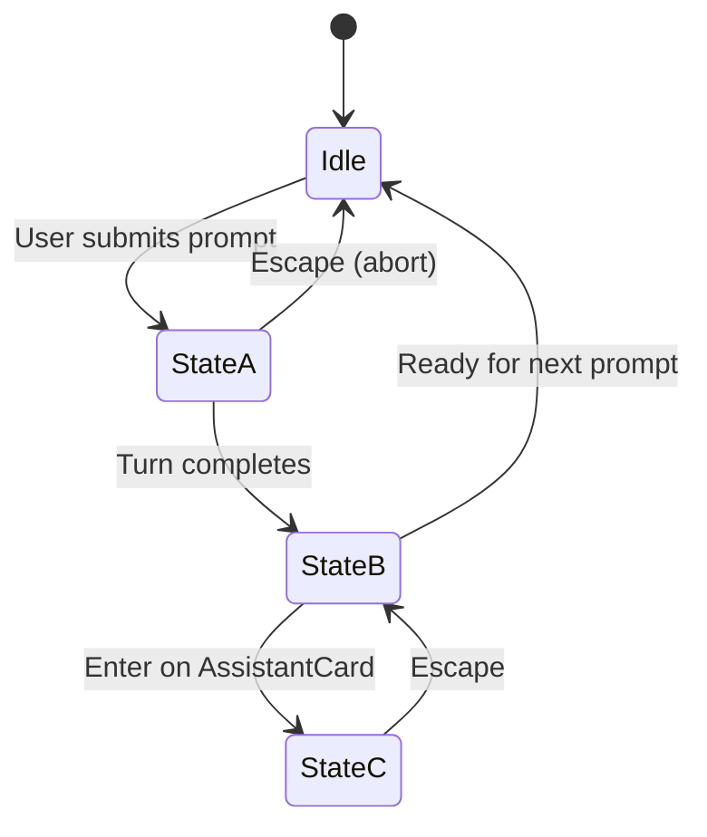

# BEP 8: Production-Grade TUI and CLI Revamp

Status: **design draft**

---

## Core Insight

The current terminal UI (`ChatApp` in `src/bos/cli/tui_app.py`) serves as a basic WebSocket verification client rather than a production-grade tool. It has several fundamental limitations:
1. **Scrolling Raw Log**: All interactions (user inputs, assistant replies, status logs, tool outputs, thinking cycles) are written to a single, static `RichLog`. Users cannot focus individual cards, select and copy code blocks cleanly, edit past prompts, or interact with elements in the transcript.
2. **Clunky Navigation**: Operations like switching chats, listing actors, or checking token usage require typing raw slash commands (e.g., `/chats`, `/resume <id>`) and reading tabular text dumped to the console. There is no visual navigation drawer, chat history browser, or dashboard view.
3. **No BEP 7 Integration**: The client does not natively understand or handle optimistic concurrency (revisions), leading to potential silent transcript conflicts, nor does it visually adapt to server-side turn states and event flows gracefully.
4. **Confusing CLI Interface**: Interactive mode is split between `boscli ask -i` (spawning an in-process local TUI) and `boscli tui` (connecting the TUI to a running background gateway). These should be unified under a logical `boscli chat` structure, and the redundant/overlapping `ask` command removed entirely.

This BEP revamps the TUI into a premium, full-width terminal application built with `Textual` inspired by modern chat interfaces (such as Codex TUI / ChatGPT layouts), reorganizes the CLI command structure to clarify the distinction between oneshot execution and interactive sessions, and integrates with the concurrency and connection resiliency patterns established in BEP 7.

To maximize the available horizontal screen width for reading code diffs, logs, and files, this design rejects the narrow side panel interface. Instead, it relies on a command-driven, full-width fuzzy-finder overlay screen for history navigation.

---

## Goals

1. **Production-Grade Textual TUI**: A beautiful, premium full-screen interface featuring:
   - Dynamic turn execution display: User Message Card pins to the top of the viewport (sticky behavior) during execution, while a `TurnTraceCard` handles trace events in the scrollable viewport.
   - Replacement transition: The `TurnTraceCard` is completely replaced by the clean `AssistantCard` once the turn is completed.
   - Detailed history view: Pressing `Enter` on the `AssistantCard` displays a full-screen `TurnHistoryPage` loaded from the chat store; pressing `Escape` returns to the chat view.
   - A full-width Fuzzy-Search Chat Selection overlay page (triggered via `Ctrl+R` or `/resume`) that supports workspace-path filtering and sorting.
   - Keyboard-navigable feed enabling users to focus message cards, code blocks, or tool logs, and copy their full raw contents using a shortcut (`c`).
   - A permanently multiline, scrollable prompt widget that dynamically grows to fit text up to the full viewport height.
   - Client-side prompt buffering showing stacked queued inputs above the prompt, and a dedicated minimal floating input dialog for active-turn steering.
2. **Unified CLI Command Organization**:
   - Introduce `boscli chat [MESSAGE]` as the sole interactive and conversational entrypoint, replacing both `boscli ask` and `boscli tui` completely.
   - Clean up top-level subcommands by grouping lifecycle commands under `boscli gateway` and chat commands under `boscli chat`.
3. **Optimistic Concurrency & Rehydration (BEP 7)**:
   - Actively track and present `base_revision` values in all outbound client requests.
   - Intercept server-side stale-send errors (`stale=True` with `missing_messages`).
   - Visually notify the user with a warning banner and automatically rehydrate the local chat log with missing messages before letting the user retry their input.
4. **Resiliency and Connection State**:
   - Provide a persistent reconnection mechanism for WebSocket failures.
   - Visually show connection status (Connected, Offline, Reconnecting) with elegant status indicator dots.
   - Queue or disable user inputs during disconnected states.
5. **Interactive Autocomplete**:
   - Extend autocomplete dropdowns for slash commands, @mention actors, and chat switching.

---

## Non-Goals

1. **Multi-User Authentication**: The TUI and gateway remain single-user applications. Permissive single-user API key models are sufficient.
2. **Web Frontends**: This proposal covers the terminal-based interactive experience only. Web and browser-based frontends remain out of scope.
3. **Generic HTTP REST Sends**: We continue to use WebSocket-based channels for live conversational exchange.
4. **Maintaining Legacy Chat Entrypoints**: This BEP defines the end-state command model. Transitional aliases may be used during implementation only if a separate compatibility decision is made, but they are not part of the accepted target design.

---

## CLI Command Reorganization

We propose the following reorganization of the `boscli` command namespace:

### Source-of-Truth CLI Decision

`boscli chat [MESSAGE]` becomes the only supported conversational entrypoint. The old `boscli ask`, `boscli ask -i`, and `boscli tui` commands are removed from the target command surface. The migration table below is a user migration guide, not a promise that the old commands remain as aliases.

This means `boscli chat "msg"` is intentionally interactive: it starts or connects to the gateway, launches the TUI, sends the initial message after session acknowledgement and history hydration, and leaves the user in the chat session. A future non-interactive command can be proposed separately, but it is not part of this BEP.

### 1. `boscli chat [MESSAGE]`
The primary and sole entry point for all conversation and actor task execution.
- If a background gateway is already running (discovered via `gateway.state`), it connects to the gateway as a dynamic `WSChannel` client (using `GatewayClient`).
- If no background gateway is running, it automatically starts the gateway in the background, waits for it to become ready, and connects to it.
- Users can pass an optional `[MESSAGE]` which will be pre-filled and sent immediately upon launch (serving the purpose of old oneshot requests).
- Removes `boscli tui`, `boscli ask -i`, and the `boscli ask` oneshot command from the target command surface.

Options:
- `-c, --config`: Specify config source or preset.
- `-w, --workspace`: Override workspace directory.
- `--agent`: Specify default actor (default: `main`).
- `--host` / `--port`: Explicitly target a gateway endpoint (bypassing auto-discovery).
- `--resume <chat_id>` / `-r`: Resume a specific chat on startup.

### 2. `boscli gateway [start|stop|status|restart]`
Unchanged, manages the background daemon process.

### CLI Migration Guide

| Old Command | New Command | Behavior |
|---|---|---|
| `boscli ask -i` | `boscli chat` | Auto-starts gateway and launches interactive TUI. |
| `boscli ask "msg" -i` | `boscli chat "msg"` | Auto-starts gateway, launches TUI, and sends message. |
| `boscli tui` | `boscli chat` | Auto-starts/resolves gateway and connects TUI. |
| `boscli ask "msg"` | `boscli chat "msg"` | Auto-starts/resolves gateway, sends prompt on startup, and runs interactively. |

---

## TUI Layout and User Experience

The TUI uses a clean vertical layout to preserve maximum terminal width for code and transcript content.

```
┌───────────────────────────────────────────────────────────────────┐
│ [connected ●]  |  Chat: tui:jerry-daily  |  Actor: @coder (default)  │ <= Status Header
├───────────────────────────────────────────────────────────────────┤
│                                                                   │
│ Assistant:                                                        │
│ Here is the code you requested:                                   │
│ ┌───────────────────────────────────────────────────────────────┐ │
│ │ def foo():                                                    │ │
│ │     print("hello")                                            │ │
│ └───────────────────────────────────────────────────────────────┘ │
│ [c] Copy code block                                               │
│                                                                   │
│ ⚡ tool: run_command() done                                       │
│ ↳ [Thinking...]                                                   │
│                                                                   │
├───────────────────────────────────────────────────────────────────┤
│ Prompt: Send a message...                                         │
│ [connected ●]   |   Base Rev: 42   |   Tokens: 2.3k ($0.04)       │ <= Status Footer
└───────────────────────────────────────────────────────────────────┘
```

---

## Turn Execution Layout and Message Cards
When a user interacts with the chat, the interface transitions dynamically across three main states:



### State A: Active Execution (Sticky Header & Internal Scroll)
When the user submits a message, the layout creates a temporary view:
- **Sticky User Card**: The User Message Card is pushed to the top of the chat area and remains pinned there as a sticky header. This provides a constant reference for the current active turn.
- **`TurnTraceCard`**: Appended directly below the sticky user card, this panel handles all stream events in real time. It displays:
  - Thinking indicators (`🤔 thinking: ...`).
  - Tool invocations and results (`⚡ tool call: ...` and `↳ result: ...`).
  - Task plan checklist updates (`📋 task plan updated: ...` showing checks/spinners) rendered inline as sequential history items.
- **Scrolling available area**: If the trace content grows too large, it scrolls internally within the remaining available screen space under the sticky user card.

```
┌───────────────────────────────────────────────────────────────────┐
│ [connected ●]  |  Chat: tui:jerry-daily  |  Actor: @coder        │ <= Status Header
├───────────────────────────────────────────────────────────────────┤
│ ┌─────────────────────────────────────────────────────────────┐   │
│ │ 🧑 You:  please refactor the auth module to use tokens     │   │ <= Sticky User Card
│ └─────────────────────────────────────────────────────────────┘   │
│ ╌╌╌╌╌╌╌╌╌╌╌╌╌╌╌╌╌╌╌╌╌╌╌╌╌╌╌╌╌╌╌╌╌╌╌╌╌╌╌╌╌╌╌╌╌╌╌╌╌╌╌╌╌╌╌╌╌╌╌  │
│  🤔 thinking: analyzing auth module dependencies...              │
│  ⚡ tool: read_file("src/auth.py")                               │
│  ↳ result: 142 lines read                                       │
│  ⚡ tool: run_command("pytest tests/test_auth.py")               │
│  ↳ [running...]  ◕                                               │ <= TurnTraceCard (scrollable)
│                                                                   │
├───────────────────────────────────────────────────────────────────┤
│ Prompt: _                                                         │
│ [connected ●]   |   Base Rev: 42   |   Tokens: 2.3k ($0.04)      │ <= Status Footer
└───────────────────────────────────────────────────────────────────┘
```

### State B: Turn Complete (Replaced with Assistant Card)
Upon completion of the agent's turn:
1. The temporary `TurnTraceCard` is completely discarded.
2. The final **`MessageCard` (Assistant)** is rendered in its place.
3. This leaves a clean, distraction-free conversational history in the main transcript (User Card -> Assistant Card).
4. The Assistant Card displays a prompt helper: `(Press Enter to view full turn execution history)`.

```
┌───────────────────────────────────────────────────────────────────┐
│ [connected ●]  |  Chat: tui:jerry-daily  |  Actor: @coder        │
├───────────────────────────────────────────────────────────────────┤
│                                                                   │
│ 🧑 You:  please refactor the auth module to use tokens            │
│                                                                   │
│ 🤖 Assistant:                                                     │
│ I've refactored the auth module. Here are the changes:            │
│ ┌───────────────────────────────────────────────────────────────┐ │
│ │ -def check_password(user, pw):                               │ │
│ │ +def verify_token(user, token):                               │ │
│ │      ...                                                      │ │
│ └───────────────────────────────────────────────────────────────┘ │
│ (Press Enter to view full turn execution history)                  │
│                                                                   │
├───────────────────────────────────────────────────────────────────┤
│ Prompt: _                                                         │
│ [connected ●]   |   Base Rev: 43   |   Tokens: 4.1k ($0.07)      │
└───────────────────────────────────────────────────────────────────┘
```

### State C: Turn History Page (Detailed Inspection)
If a user selects the completed Assistant Card and presses `Enter` (or clicks it):
- The central chat pane transitions (or overlays) to a full-screen **`TurnHistoryPage`**.
- This page pulls detailed trace data from the `ChatStore` (e.g. arguments, console stdout/stderr, execution timings, exact tokens spent).
- The user can scroll this full history page normally.
- Pressing `Escape` exits the history page and restores the main chat layout, placing the scroll position exactly where it was before.

---

## Fuzzy-Search Chat Selection Page

When the user types `/resume` without arguments or presses **`Ctrl+R`**, the TUI pauses prompt editing and overlays a full-width **Resume Session Page** (similar to a command palette or terminal fuzzy finder):

```text
Resume a previous session

Type to search                                           Filter: [Cwd] All   Sort: [Updated] Created

> 1d ago      "docs/BEP/BEP 7: Gateway and Channel Architecture.md" please do a criticism review...
  10d ago     the goal of this task is to bring the BOS default agent to the level of Claude Code...
  12d ago     '/Users/jerry/Repo/workbench/bos-ai/docs/debate/BEP 5: Critical Review...'
  15d ago     please do code review on the staged changes for the BEP 4
```

### Components and Interaction:
1. **Fuzzy Search Input**: Typing instantly filters historical chats from the `ChatStore` by searching prompt text and pathnames.
2. **Path & Sort Filtering**:
   - `Left`/`Right` arrow keys cycle active filters (e.g., filtering for chats initiated in the current working directory `[Cwd]` vs `All` directories).
   - Hotkeys cycle sorting by `[Updated]` timestamp or `Created` timestamp.
3. **Cursor Navigation**:
   - `Up`/`Down` arrow keys (or `k`/`j`) move the selection cursor (`>`).
   - Relative timestamps and first prompt snippets are rendered fully across the width of the terminal.
4. **Selection Confirmation**:
   - Pressing **`Enter`** selects the active chat, loads its cursor on the gateway, clears the current viewport, and rehydrates the chat history.
   - Pressing **`Escape`** dismisses the overlay and returns to the active conversation immediately without modifications.

---

## Keyboard-Driven Input & Selection

The TUI provides separate keybindings for input prompt editing and feed navigation:

### 1. Permanent Multiline Prompt Widget
The `#prompt` input is a permanently multiline, scrollable widget supporting advanced text input:
- **Dynamic Growth**: The widget starts at a compact height (e.g., 2 lines). As lines are typed or pasted, it grows vertically, shrinking the chat area layout above it.
- **Full Viewport Scaling**: If the user pastes an extensive text block (e.g., 200 lines of code), the prompt expands to 100% of the viewport height, temporarily hiding the history view. If content exceeds the screen height, it enables internal vertical scrolling.
- **Keys**:
  - `Enter`: Submits the current content.
  - `Shift+Enter`: Inserts a newline (`\n`) character.
- **Readline History**: Pressing `Up Arrow` and `Down Arrow` while editing cycles through previously submitted prompts. The history is persisted across sessions in `~/.bos/tui_history` (or `<workspace>/.bos/tui_history`).

### 2. Feed Navigation & Focus Transition
To move keyboard focus out of the input field:
- Pressing **`Shift+Tab`** shifts focus from the prompt input up into the scrollable chat feed history. This binding is always available regardless of TUI state (idle, executing, overlay open).
- Once inside the feed:
  - `Up Arrow` / `Down Arrow` (or `k` / `j`) selects cards or blocks (Message Card, Code Block, Tool trace).
  - Pressing `Escape`, `Tab`, or simply **typing any character** returns focus to the prompt input.

### 3. Focused Copy Shortcut (`c` key)
When focus is on a feed element:
- **Message Card**: Copies the entire raw markdown text of the user/assistant message to the clipboard.
- **Code Block**: Copies only the raw code block text, ignoring terminal margins and sidebar structures.
- **Tool Trace Card**: Copies the raw command and its full output logs.
- **Feedback**: A brief visual flash or tool-tip overlay indicates successful copying.

---

## Prompt Queueing & Turn Interruptions

During an ongoing execution turn (busy state), new prompt inputs and steering actions are managed through dedicated containers to ensure clarity:

### 1. Input Buffering (Prompt Queue Stack)
- If the user presses **`Enter`** (normal submit) while the actor is running a turn:
  - The client intercepts the submit.
  - The input text is appended to a local client-side memory queue (`self._prompt_queue`).
  - The text is cleared from the prompt, and the queued item is pushed onto a **vertical stack widget (`#queue-stack`)** rendered directly on top of the prompt input bar (e.g., `⏳ Queue (1 item): [1] <text>`).
  - Once the current turn finishes, the TUI automatically pops the first item off the stack, sends it with the latest `base_revision`, and the remaining items shift down.

```
├───────────────────────────────────────────────────────────────────┤
│ ⏳ Queue (2 items):                                               │
│  [1] now fix the failing tests                                    │
│  [2] also update the README                                       │ <= #queue-stack
├───────────────────────────────────────────────────────────────────┤
│ Prompt: _                                                         │
│ [connected ●]   |   Base Rev: 43   |   Tokens: 4.1k ($0.07)      │
└───────────────────────────────────────────────────────────────────┘
```

### 2. Live Turn Interjections (Minimal Interrupt Dialog)
- If the user wants to steer the active agent during execution:
  - The user presses **`Ctrl+Enter`** while the TUI is busy.
  - This displays a **minimal floating input widget** overlay centered on the screen (no surrounding window boxes, title labels, or buttons).
  - Pressing **`Enter`** inside this input widget submits the text as an `INTERRUPT_MESSAGE` to the active turn, closes the widget, and appends the trace inline: `⚡ User Interrupt: "<message>"`.
  - Pressing **`Escape`** cancels and dismisses the widget without sending.

```
┌───────────────────────────────────────────────────────────────────┐
│                                                                   │
│  🤔 thinking: refactoring auth module...                          │
│  ⚡ tool: write_file("src/auth.py")                               │
│                                                                   │
│              ┌─────────────────────────────────┐                  │
│              │ skip the tests for now, focus _  │                  │ <= Interrupt Input (floating)
│              └─────────────────────────────────┘                  │
│                                                                   │
│  ↳ [running...]  ◕                                                │
│                                                                   │
├───────────────────────────────────────────────────────────────────┤
│ Prompt: (disabled during interrupt input)                          │
└───────────────────────────────────────────────────────────────────┘
```

### 3. Turn Cancellation (Abort)
- Pressing **`Escape`** while the TUI is busy sends an `INTERRUPT_ABORT` envelope to immediately terminate the active turn, showing `⏹ Turn interrupt requested` in the log.

### 4. `Escape` Key Priority Chain
Because `Escape` is contextual, the TUI resolves it with a strict priority order:
1. If the **interrupt input dialog** is open → dismiss the dialog (no abort sent).
2. If the **chat selection overlay** is open → dismiss the overlay.
3. If focus is in **feed navigation** → return focus to the prompt input.
4. If the **agent is executing** and focus is on the prompt → send `INTERRUPT_ABORT`.
5. Otherwise → no-op.

---

## Slash Commands Taxonomy

The TUI implements a minimal, curated set of slash commands, eliminating redundant text outputs in favor of the visual interface:

| Command | Type | Target | Description |
|---|---|---|---|
| `/new` | Shared | Server | Resets the conversation cursor; returns a fresh `chat_id`. `Ctrl+N` is a convenience shortcut. |
| `/resume [partial]` | Shared | Server | Without args, opens the Fuzzy Chat Selection Page. With a partial string, opens the finder pre-filtered to that text. |
| `/restart` | Client | Gateway | Triggers a gateway process restart. |
| `/actor <name>`| Client | Client | Updates the default target actor for future prompts in the session (e.g., `/actor coder`). |
| `/theme <name>`| Client | Client | Changes the Textual TUI visual color palette. |
| `/clear` | Client | Client | Empties the current scroll feed viewport. |
| `/quit` | Client | Client | Gracefully exits the TUI app. |

---

## Adaptations to BEP 7

The revamped TUI acts as a robust WebSocket channel client and must conform to the new Gateway conventions:

### 1. Client-Side Concurrency Handling
Under BEP 7, chats use monotonic sequence revisions (`chat_revision`). The TUI client tracks the observed revision locally:
- **Sending Messages**: Every user prompt includes the client's current `base_revision`.
- **Handling Stale Errors**:
  If the server replies with a structured stale system event such as `stale_chat`, `stale_channel_cursor`, `unobserved_chat`, or `future_base_revision` during the send preflight:
  1. The TUI client intercepts the result.
  2. It uses the event `missing_messages` payload when present; otherwise it retrieves missing messages between `base_revision` and the server's `current_revision` through the gateway history API.
  3. It appends the missing messages to the chat view in revision order.
  4. It displays an overlay or warning banner: `[WARNING] This chat has updated from another client. The missing messages have been loaded below. Please review and resubmit.`
  5. It returns the user's unsubmitted message to the prompt field, preventing silent history loss.
  6. It updates the displayed base revision to the server's current revision.

### 2. Reconnection Resiliency
If the WebSocket connection drops:
- The status bar displays `[offline ○ reconnecting...]`.
- The input field is disabled to prevent typing blind messages.
- An exponential backoff reconnection loop tries to re-establish the connection.
- Upon reconnection:
  - It authenticates via the API key.
  - It receives a fresh session acknowledgement containing the current revision.
  - It hydrates all messages after the last locally rendered revision before enabling normal prompt submission.

### 3. Prompt Submission Lifecycle
Normal prompt submission follows a strict lifecycle:
1. If disconnected, the prompt remains editable but cannot be submitted; the footer explains that sending is paused until reconnect.
2. If idle and connected, the TUI renders a user card, sends the message with the current `base_revision`, and enters active-turn state.
3. If active-turn state is already busy, normal `Enter` queues the prompt locally in `#queue-stack`; it does **not** send to the gateway until the active turn commits or aborts.
4. When an assistant reply commits and the client observes the updated revision, the TUI pops the first queued prompt and sends it with the latest `base_revision`.
5. If the active turn is aborted, queued prompts remain queued and the user may edit, delete, or send them explicitly from the queue UI.
6. `Ctrl+Enter` is not queued; it opens the interrupt input and sends `INTERRUPT_MESSAGE` against the active turn only.

---

## Technical Details

### Gateway Read API

Conversation writes and live turn events continue to use the WebSocket channel. Read-only metadata and hydration use authenticated HTTP endpoints on the same gateway so visual screens do not need to encode large table payloads inside slash-command text.

All endpoints use the existing gateway API-key middleware.

| Endpoint | Purpose | Response shape |
|---|---|---|
| `GET /api/chats` | List known chats for the resume finder. Supports optional `q`, `workspace`, `sort=updated|created`, and `limit` query params. | `{ "ok": true, "chats": [ChatMetaPayload...] }` |
| `GET /api/chats/{chat_id}/messages?from_revision=N` | Hydrate a transcript or fetch stale/offline missing messages. | `{ "ok": true, "chat_id": "...", "current_revision": 42, "messages": [MessagePayload...] }` |
| `GET /api/chats/{chat_id}/turns/{turn_id}` | Optional detailed turn-history fetch when persisted trace events exist. | `{ "ok": true, "chat_id": "...", "turn_id": "...", "events": [TurnEventPayload...], "messages": [MessagePayload...] }` |

`ChatMetaPayload`:
```json
{
  "chat_id": "abc123",
  "message_count": 12,
  "last_activity": "2026-06-06T14:00:00Z",
  "has_summary": false,
  "latest_summary_at": null,
  "description": "first user prompt preview",
  "workspace": "/path/to/workspace"
}
```

`workspace` is optional until chat stores persist workspace attribution. If it is absent, the resume finder must keep the CWD/All filter visible but treat all chats as `All`.

`MessagePayload`:
```json
{
  "llm_message": {"role": "assistant", "content": "hello"},
  "metadata": {"chat_revision": 42},
  "turn_id": "turn-abc",
  "created_at": "2026-06-06T14:00:00Z",
  "is_summary": false
}
```

The first implementation of `TurnHistoryPage` may combine live-collected `TurnEvent` records with committed messages. Full cross-restart turn trace history requires persisted trace events and can be implemented after this BEP's primary UI/CLI revamp.

### Command Dispatch & Client Protocols
The client interfaces will be standardized:
```python
class TuiClient(Protocol):
    @property
    def client_id(self) -> str: ...
    @property
    def chat_id(self) -> str: ...
    @property
    def connected(self) -> bool: ...
    
    async def connect(self, takeover: bool = False) -> None: ...
    async def send(self, content: str, *, content_type: str = "message", chat_id: str | None = None, metadata: dict | None = None) -> None: ...
    async def receive(self) -> Envelope: ...
    async def list_actors(self) -> dict[str, Any]: ...
    async def list_chats(self, *, q: str | None = None, workspace: str | None = None, sort: str = "updated", limit: int = 100) -> list[dict[str, Any]]: ...
    async def get_messages(self, chat_id: str, *, from_revision: int | None = None) -> dict[str, Any]: ...
    async def aclose(self) -> None: ...
```
Because the client always connects via the Gateway under the new design, `LocalClient` and `_run_interactive` are removed. All command dispatch goes through `GatewayClient`, which owns insertion of `base_revision` into outbound metadata from its observed `current_revision`.

### TUI Config Shape

Optional TUI preferences live under `[cli.tui]`:
```toml
[cli.tui]
theme = "tokyo-night"
history_path = "~/.bos/tui_history"
max_prompt_height_ratio = 1.0
```

- `theme`: Textual theme name. Defaults to `tokyo-night`.
- `history_path`: persisted prompt-history file. Relative paths are resolved against the workspace BOS directory.
- `max_prompt_height_ratio`: maximum portion of the viewport the prompt can occupy after paste/growth. Defaults to `1.0` to allow the BEP's full-viewport prompt behavior.

### Keyboard Shortcuts Reference

| Shortcut | Action | Description |
|---|---|---|
| `Ctrl+R` | Resume Chat Finder | Opens the full-width fuzzy-search Chat Selection Page overlay. |
| `Shift+Tab` | Focus Feed | Moves focus from prompt into the chat feed. Always available. |
| `Tab` / `Escape` | Focus Prompt | Returns focus from feed back to the prompt input. |
| `Ctrl+Enter` | Show Interrupt Input| Displays the minimal floating steering input widget during active execution. |
| `Ctrl+L` | Clear Terminal | Clears the TUI chat log view. |
| `Ctrl+N` | New Chat | Convenience shortcut for `/new`. |

---

## Open Questions

1. **How should system copy clipboard utilities be handled cross-platform?**
   - *Proposal*: Use `pyperclip` or similar light dependency for cross-platform system clipboard access. If it fails, fall back to showing a copy dialogue or log notification.
2. **Should detailed turn traces be persisted beyond the live TUI session?**
   - *Proposal*: The first implementation should show live-collected trace events plus committed chat messages. Persistent trace storage can be proposed as a follow-up once the card UI, gateway read APIs, and turn history screen exist.

---

## Revision History

| Date | Change | Intention |
|---|---|---|
| 2026-06-04 | Initial BEP 8 draft | Revamp TUI design and CLI command layout in accordance with BEP 7 |
| 2026-06-06 | Design review pass | Resolve Escape precedence, remove side panel references, fix shortcut conflicts, clarify /resume and /restart |
| 2026-06-06 | Implementation spec pass | Clarify CLI end state, add gateway read APIs, define prompt/reconnect lifecycles, and specify `[cli.tui]` config |
